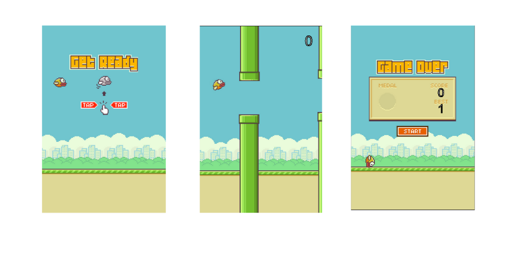

# Flappy_bird
This is a flappy bird game. It's based on object oriented javaScript and HTML Canvas.

### How can I play Flappy bird?
* You can visit this: [Link](https://ckbhatia.github.io/Flappy_bird)
* Or you can clone this repo and open index.html

### How to play this game?
* There is a player flappy bird.
* You have to keep this bird flapping all the way.
* Your bird must not touch to top or bottom boundry.
* Your bird must not touch to any frequently coming pipes.
* As your bird pass the pipes, you score will increment one by one.
* You can score higher as you keep the bird safe.

### Here are some snapshots of the flappy bird game

#### Thanks 
__Code explained youtube channel__

Link of video: [link](https://www.youtube.com/watch?v=0ArCFchlTq4)

#### Author
*Chetan kumar*